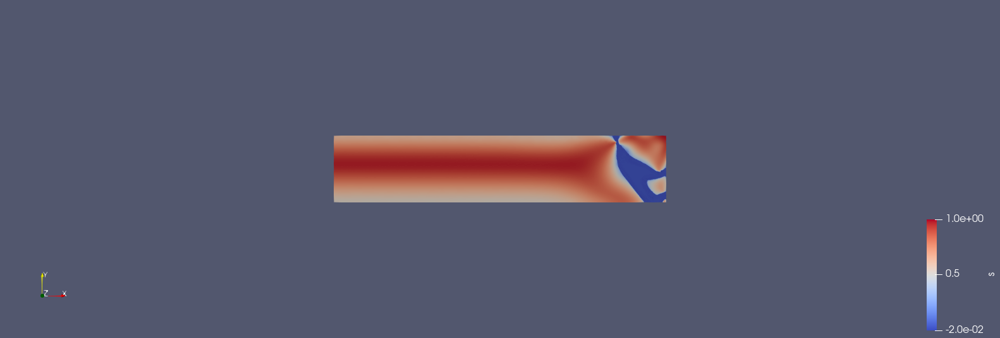

# MICI_Simulation
Marine Ice-Cliff Instability Model using the FEniCS computing platform

  

How to use:
<ol>
<li> if necessary use <code>chmod +x create_mesh.sh</code> and <code>chmod +x simulate.sh</code> </li>  
<li> Use <code>./create_mesh.sh</code> to create a Mesh that models the Ice cliff </li>
<li> Use <code>python3 Simulation/glacier_phase_field.py</code> to execute the simulation. </li>
</ol>
